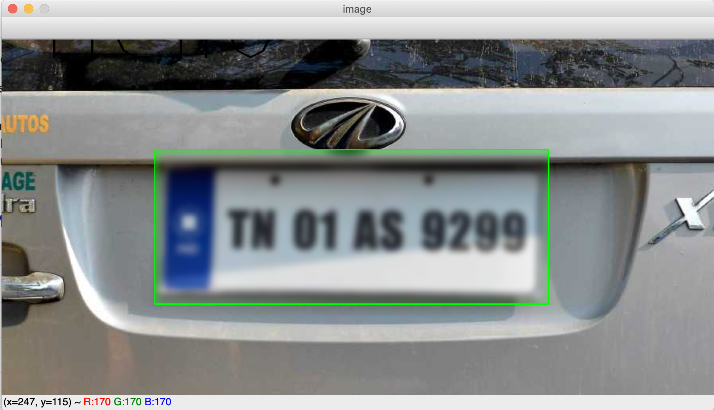

# DrawNBlur
A Simple implementation of OpenCV to draw a rectangle over an area on a given image and apply "Average Blur" on the selected Area.

## How it Works

- Drag and draw a box over the image you want to blur

- On releasing the mouse click , a box will be drawn

- Press **b** to blur the image.  
Note: Repeated press of **b** Blurs the image even more

- Press **r** to reset the changes on the image

- Press **c** to close the window

 

 

